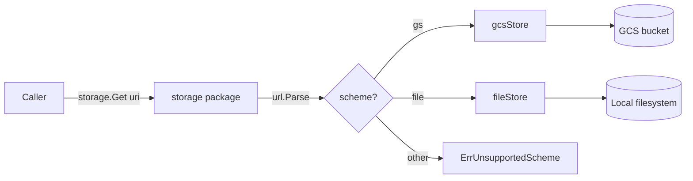

# exp/storage: URI-based storage abstraction over GCS and local filesystem

**Author:**
**Reviewers:**
**Status:** Draft
**Last Updated:** 2026-04-18

<!-- Status lifecycle: Draft -> Approved -> Implemented (v1) -> Implemented (v2) -->

## Motivation

The `gcs/` package is a thin wrapper around `cloud.google.com/go/storage` that ties every caller to Google Cloud Storage. Anything that wants to read or write blobs — `exp/manifest/manifest.go` is the current example — has to pay the price of a real GCS client even when the operation is trivially filesystem-shaped.

This has three concrete costs:

1. **Local development friction.** Running or debugging anything that touches `gcs.Get`/`Put` requires credentials and a reachable bucket. Offline work is blocked.
2. **Test speed and flakiness.** Unit tests either mock the GCS client (awkward; the `gcs` package exposes free functions, not an interface) or hit real buckets (slow and flaky).
3. **Deployment rigidity.** Small self-hosted deployments of tools built on this repo shouldn't have to stand up a GCS bucket for what is effectively "put a file on disk."

A URI-based abstraction with `gs://` and `file://` backends lets callers swap storage with a config string. No other code changes.

## Context

### What exists today

`gcs/gcs.go` exposes five free functions, all taking `(ctx, bucket, key, ...)`:

- `Get(ctx, bucket, key) ([]byte, error)`
- `PutFile(ctx, bucket, key, source) error`
- `PutBytes(ctx, bucket, key, data, contentType) error`
- `Delete(ctx, bucket, key) error`
- `List(ctx, bucket) ([]*storage.ObjectAttrs, error)`

`List` leaks `*storage.ObjectAttrs` from the GCS SDK directly to callers. Every call opens and (mostly) closes its own `storage.Client` — there's no connection reuse.

The one in-tree consumer is `exp/manifest/manifest.go` (lines 92, 108, 112, 129), which hardcodes `gcs.Get`/`PutBytes`/`List`/`Delete` against a bucket name held on a struct.

### What's broken or inadequate

- No seam for substituting a non-GCS backend.
- `List` returns a GCS-specific type, so any abstraction has to either re-wrap it or replicate the leak.
- No ergonomic way to say "read this artifact, wherever it lives" — callers must already know it's in GCS.

### Constraints

- Must not break `exp/manifest/manifest.go`. Either keep the `gcs` package as-is and layer on top, or migrate `manifest` in the same change.
- Go 1.25 toolchain. No new heavyweight dependencies — standard library is sufficient for the filesystem backend.
- Keep the package experimental (`exp/`) until the surface stabilizes.

## Recommendation

Build `exp/storage` as a URI-dispatched abstraction with two backends:

- `gs://bucket/key/path` — talks to Google Cloud Storage directly via `cloud.google.com/go/storage`.
- `file:///abs/path/to/object` — reads and writes directly on the local filesystem, with a sidecar `.meta.json` for `ContentType`.

Expose both a `Store` interface (for callers that want to bind once or inject a mock) and package-level functions (for callers that just want `storage.Get(ctx, uri)` and are happy to pay a URI parse per call). The package-level functions dispatch through `For(uri)`.

The v1 surface mirrors today's `gcs` package exactly — `Get`, `PutFile`, `PutBytes`, `Delete`, `List` — so migration from `gcs.X(ctx, bucket, key)` to `storage.X(ctx, uri)` is mechanical.

All calls into `cloud.google.com/go/storage` live inside `exp/storage`. The new package does **not** depend on `github.com/heatxsink/x/gcs`. `gcs/` is marked deprecated in the same change and becomes a pass-through candidate for removal.

On the file backend: preserve `ContentType` via a sidecar `<path>.meta.json` file (sidecar is part of v1), recursive `List`, create parent directories on write. `CacheControl` is still ignored.

## Goals

- A single call site (`storage.Get(ctx, uri)`) can address either GCS or local disk without the caller knowing which.
- `exp/manifest` migrates off direct `gcs.*` calls with no behavior change for its GCS users.
- Tests for any consumer of `exp/storage` can run against a `t.TempDir()` with no credentials and no network.
- `List` returns a backend-neutral `Object` type. Nothing from `cloud.google.com/go/storage` leaks into the public surface.
- Adding a third backend later (e.g. S3, in-memory) requires implementing `Store` and registering a scheme. No changes to callers.

## Non-Goals

- **`CacheControl` parity on local.** GCS-native and not meaningful on a filesystem; accepted and discarded.
- **Streaming reader/writer API.** v1 stays byte-slice-oriented to match today's `gcs` surface. `NewReader`/`NewWriter` are deferred.
- **A registry for user-defined schemes.** Two hardcoded backends is enough. A registry can come when a third backend appears.
- **Migration of consumers outside this repo.** Only `exp/manifest` is in scope here.
- **Keeping `x/gcs` as a public API.** It is deprecated in the same change in favor of `exp/storage`.

## Design

### Package layout

```
exp/storage/
  storage.go    // Store interface, Object type, For(uri), package-level dispatchers
  gcs.go        // gcsStore — uses cloud.google.com/go/storage directly, lazy client
  file.go       // fileStore — os/filepath-backed, with .meta.json sidecar
  storage_test.go
  file_test.go
```

### URI conventions

| Scheme   | Example                             | Interpretation                                      |
|----------|-------------------------------------|-----------------------------------------------------|
| `gs`     | `gs://my-bucket/configs/app.yaml`   | `Host` = bucket, `Path` (stripped of `/`) = key.    |
| `file`   | `file:///var/lib/app/configs/app.yaml` | `Path` = absolute filesystem path.               |

`List` treats the URI as a prefix (GCS) or a directory root (file). Both are recursive.

### Public surface

```go
package storage

type Object struct {
    URI         string
    Size        int64
    ContentType string    // populated from sidecar on file://, from attrs on gs://
    Updated     time.Time
}

type Store interface {
    Get(ctx context.Context, uri string) ([]byte, error)
    PutFile(ctx context.Context, uri, source string) error
    PutBytes(ctx context.Context, uri string, data []byte, contentType string) error
    Delete(ctx context.Context, uri string) error
    List(ctx context.Context, uri string) ([]Object, error)
}

// For returns the Store for the URI's scheme.
func For(uri string) (Store, error)

// Package-level convenience — each dispatches via For(uri).
func Get(ctx context.Context, uri string) ([]byte, error)
func PutFile(ctx context.Context, uri, source string) error
func PutBytes(ctx context.Context, uri string, data []byte, contentType string) error
func Delete(ctx context.Context, uri string) error
func List(ctx context.Context, uri string) ([]Object, error)
```

No exported types beyond `Store` and `Object`. Backend structs (`gcsStore`, `fileStore`) are unexported; callers that need a specific backend use `For(uri)`.

### Dispatch flow



### Backend behavior

**gcsStore**

- Holds a `*storage.Client` field plus `sync.Once` init error. Client is lazily created on first call using that call's `ctx`. Subsequent calls reuse it. No `Close()` on the interface (see "Interface stability" below).
- `Get`/`PutFile`/`PutBytes`/`Delete`: split the URI into `(bucket, key)` and call the GCS SDK (`bucket.Object(key).NewReader`, `NewWriter`, `Delete`).
- `List`: iterates `bucket.Objects(ctx, &storage.Query{Prefix: key})`, translates `*storage.ObjectAttrs` into `Object`, setting `URI = gs://<bucket>/<name>`, `Size`, `ContentType`, `Updated = attrs.Updated`.

**fileStore**

- `Get`: `os.ReadFile(path)`.
- `PutFile`: `os.MkdirAll(dir, 0o755)` then `io.Copy` from source file. Preserves byte-exact content. No sidecar is written (no `contentType` parameter to record).
- `PutBytes`: `os.MkdirAll(dir, 0o755)` then `os.WriteFile(path, data, 0o644)`. If `contentType != ""`, write a sidecar at `<path>.meta.json` with `{"content_type": "..."}`.
- `Delete`: `os.Remove(path)`, then best-effort `os.Remove` of the sidecar (ignore `fs.ErrNotExist`).
- `List`: `filepath.WalkDir(root)` — recurses, emits regular files only, skips any path ending in `.meta.json`. For each file, best-effort read of `<path>.meta.json` populates `ContentType`. `URI = file://<abs-path>`, `Size = info.Size()`, `Updated = info.ModTime()`.

**Sidecar format**

```json
{ "content_type": "application/json" }
```

Sidecar is optional on read — missing or malformed sidecar leaves `ContentType` empty and does not fail the operation.

### Interface stability

The `Store` interface is designed so that future enhancements don't force a breaking change:

- **Connection reuse** (already v1 for GCS): lives inside `gcsStore` via `sync.Once`. No interface change.
- **Explicit client lifecycle**: would add `Close() error` to `Store`. Deferred until a caller needs it — `fileStore.Close()` would be a no-op.
- **Streaming reader/writer**: additive new methods (`NewReader`, `NewWriter`). Does not affect the five v1 methods.
- **Additional schemes**: new backend type + one case in `For`. Zero caller impact.

### Errors

- Unknown scheme: a sentinel `ErrUnsupportedScheme` returned from `For`. Callers can `errors.Is` against it.
- All errors are wrapped with `%w` and context (`"storage: parse %q: %w"`, `"storage: get %q: %w"`). Error strings stay low-cardinality — URIs attached as wrapped context, not interpolated into the lead message.
- Backend errors pass through. `fs.ErrNotExist` works naturally on the file backend; GCS equivalents bubble up from the `gcs` package.

### Consumer migration: `exp/manifest`

`Manifest` currently stores a `bucket string`. It will hold a `baseURI string` instead (e.g. `gs://my-bucket` or `file:///var/lib/app/manifests`), and each call site switches:

| Before                                                    | After                                          |
|-----------------------------------------------------------|------------------------------------------------|
| `gcs.Get(ctx, m.bucket, manifestKey)`                     | `storage.Get(ctx, m.baseURI + "/" + manifestKey)` |
| `gcs.PutBytes(ctx, m.bucket, manifestKey, data, "…")`    | `storage.PutBytes(ctx, ..., data, "application/json")` |
| `gcs.List(ctx, m.bucket)`                                 | `storage.List(ctx, m.baseURI)`                 |
| `gcs.Delete(ctx, m.bucket, k.Name)`                       | `storage.Delete(ctx, obj.URI)`                 |

A helper (`joinURI(base, key string) string`) on the manifest side keeps call sites tidy.

### Testing strategy

- `fileStore`: table-driven tests against `t.TempDir()`. Covers round-trip, sidecar roundtrip for `ContentType`, missing-file errors, recursive `List`, parent-directory creation, path-traversal rejection.
- `gcsStore`: URI parsing and translation logic tested in isolation. Full integration tests against a real bucket live behind a build tag (`//go:build integration`), consistent with the rest of the repo.
- Scheme dispatch: unit tests that `For` returns the expected backend or `ErrUnsupportedScheme` for each scheme.
- `exp/manifest` tests migrate to use a tempdir-backed `file://` base URI, removing the need for GCS credentials in CI (done in the follow-up migration PR).

### List ordering

Both backends return results in lexicographic order by URI. GCS yields this naturally from its iterator; the file backend sorts `filepath.WalkDir` results to make the guarantee explicit and cross-backend stable.

## Long-term Vision

The same interface absorbs additional backends as they become needed:

- `s3://` for AWS.
- `mem://` for in-process tests that want to assert on stored bytes without touching disk.
- `http(s)://` read-only backend for fetching from a CDN or static origin.

Beyond schemes, the natural v2 features are:

- A streaming surface — `NewReader`/`NewWriter` — for objects too large to hold in `[]byte`.
- A `Copy(ctx, srcURI, dstURI)` that optimizes same-backend copies (GCS object copy, hardlink on local) and falls back to stream-through.
- Metadata round-trip on the file backend via a sidecar `.meta.json` (or extended attributes where available).
- An `Exists(ctx, uri) (bool, error)` helper.

None of these changes the v1 caller surface. All of them are additions.

## MVP Scope

Shipped in two PRs:

**PR 1 — `exp/storage` package**

- `Store` interface, `Object` type, `For(uri)`, package-level dispatchers.
- `gcsStore` using `cloud.google.com/go/storage` directly, lazy client via `sync.Once`.
- `fileStore` for `file://`, recursive `List`, sidecar `.meta.json` for `ContentType`, path-traversal rejection.
- Deprecation notices on every exported function in `x/gcs` pointing to `exp/storage`.
- Unit tests for dispatch + file backend. Integration tests gated by build tag.

**PR 2 — `exp/manifest` migration**

- `Manifest` switches from `bucket` field to `baseURI`.
- `gcs.*` call sites swap to `storage.*`.
- `exp/manifest` tests gain a tempdir-backed `file://` path.

Deferred (tracked in Long-term Vision): streaming API, `Exists`, `Copy`, additional schemes, explicit `Close()`. Each deferral is additive — v1 callers won't need to change when these land.

## Alternatives Considered

### Add an interface directly to the `gcs` package

**Description:** Promote the existing free functions to methods on a `Client` type, add an interface, and ship a second implementation for local filesystem under the same package.

**Why rejected:** Conflates two concepts (GCS client, storage abstraction) in one package, and keeps every caller importing `gcs` even when the target is `file://`. Also widens the blame radius of any change to `gcs/`. Cleaner to leave `gcs/` as the GCS-specific primitive and layer the abstraction above it.

### Use a third-party blob abstraction (`gocloud.dev/blob`)

**Description:** Adopt Go Cloud's `blob` package, which already provides URI-based dispatch across GCS, S3, Azure, and a filesystem backend.

**Why rejected:** Heavy dependency for a repo that currently has one consumer and two target backends. Pulls in a large transitive graph, locks the surface to someone else's abstractions, and is overkill for the actual need. Revisit if we ever need three or more real cloud backends.

### Ship only the `Store` interface, no package-level functions

**Description:** Force every caller to go through `s, _ := storage.For(uri); s.Get(ctx, uri)`.

**Why rejected:** Noisier at call sites with no real benefit. Package-level helpers are a two-line convenience that preserve the option of binding a `Store` when it matters (tests, dependency injection).

### Do Nothing / Minimal

**Description:** Leave `gcs/` as-is. Let each consumer that wants a local backend roll its own swap.

**Why rejected:** `exp/manifest` already wants this, and every future consumer will want it too. Pushing the abstraction to each caller guarantees N inconsistent versions of it. The cost of a small shared package is lower than the cost of N ad-hoc ones.

## Security & Privacy Considerations

- **Path traversal on `file://`.** Always-on rejection. Any URI whose `url.Parse` path contains a `..` segment, or whose `filepath.Clean`'d form does not equal the original, returns `ErrInvalidPath` before touching the filesystem. No opt-out.
- **No credentials in URIs.** `gs://` URIs carry only bucket and key. Authentication remains the responsibility of the GCS client (ADC / service account), unchanged from today.
- **File permissions.** `fileStore` writes `0o644` files and `0o755` directories. Callers handling sensitive data should consider whether those defaults are acceptable; a follow-up can expose umask-style options if needed.

## Resolved Decisions

1. **Sidecar for `ContentType` on `file://`** — in v1.
2. **Path-traversal guard** — always-on; rejects on parse.
3. **`List` ordering** — lexicographic, guaranteed on both backends.
4. **Rollout** — `exp/storage` lands first, `exp/manifest` migrates in a follow-up PR.
5. **Package placement** — `exp/storage`.
